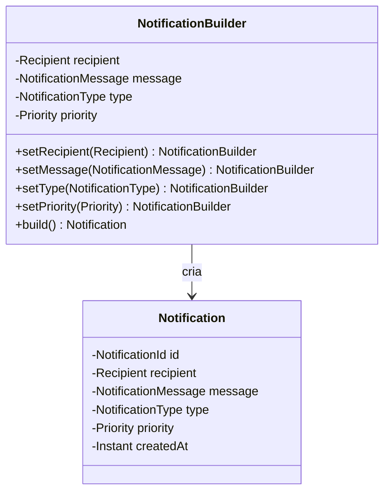
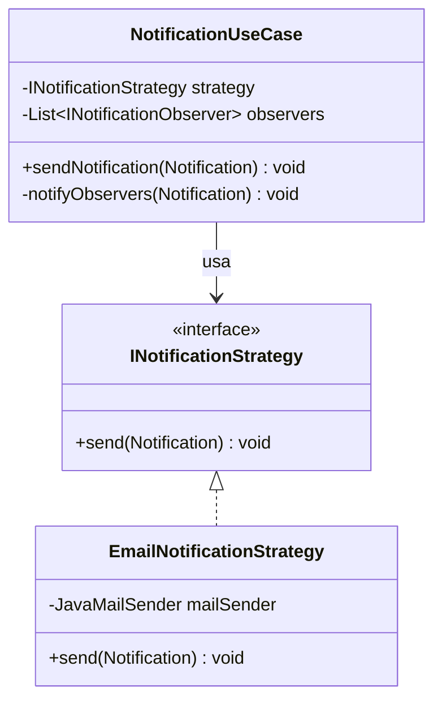
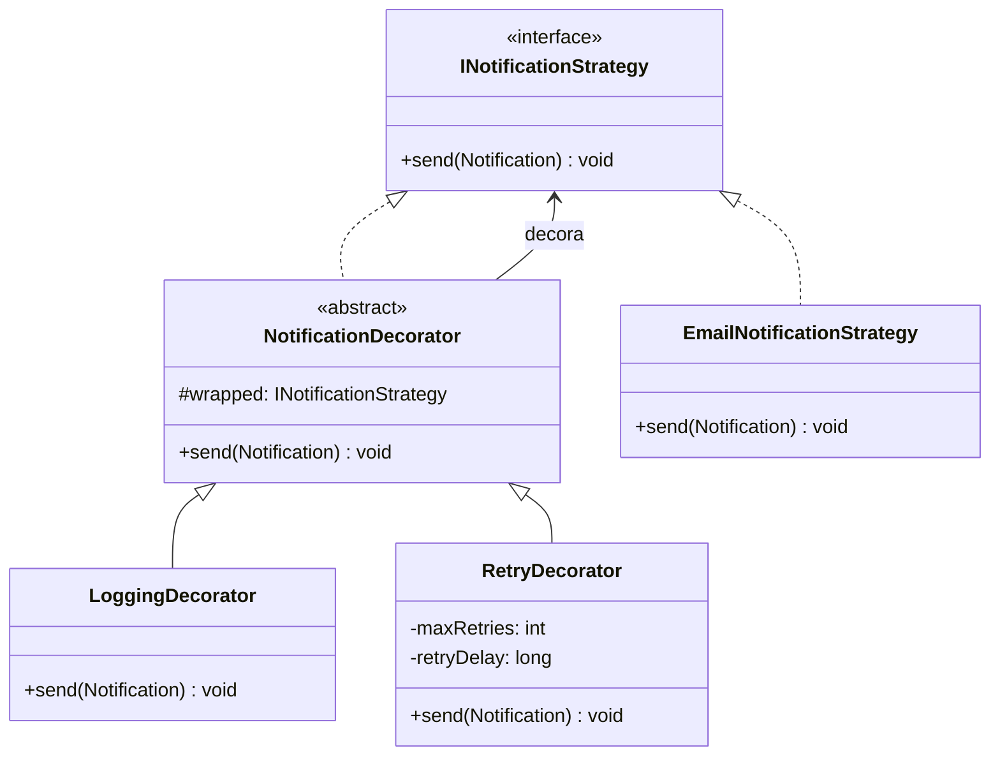
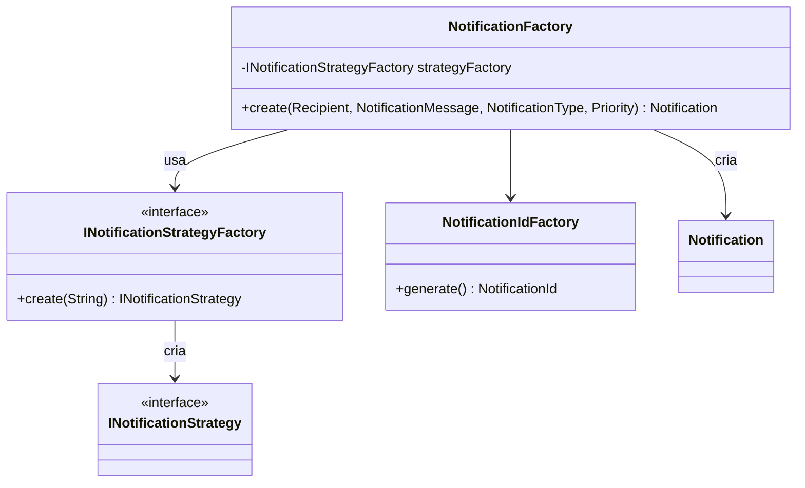
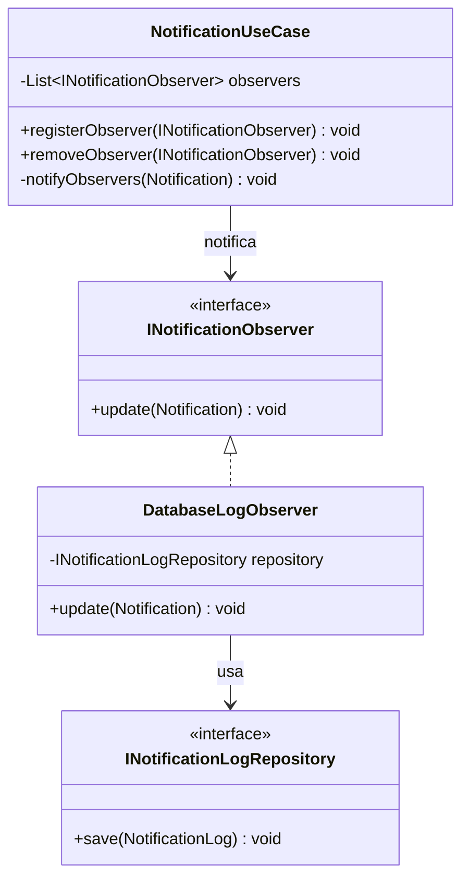
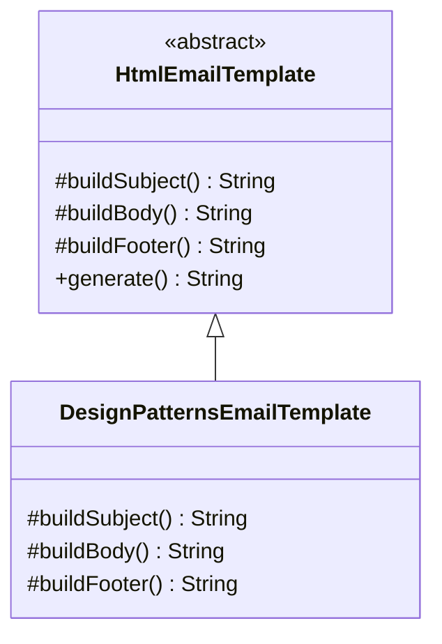
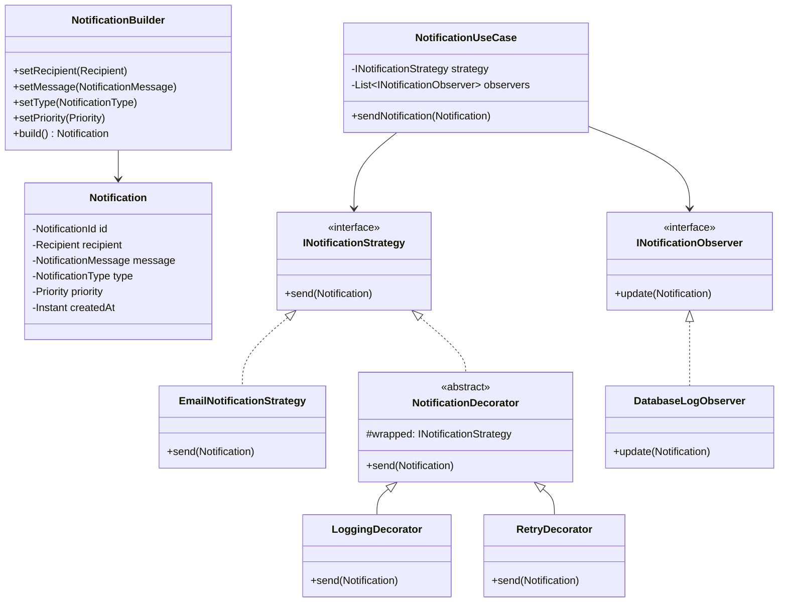

# Notification Hub - Documentação de Padrões de Projeto

## 📋 Descrição do Projeto

O **Notification Hub** é uma aplicação Java que demonstra a implementação de diversos padrões de projeto (Design Patterns) em um sistema de gerenciamento e envio de notificações. O projeto utiliza **Java 21 LTS** e **Maven** como ferramenta de build.

## 🏗️ Arquitetura

A arquitetura do projeto é dividida em três camadas principais:

### 1. **Domain Layer** (Camada de Domínio)
Contém as entidades de negócio e regras de domínio:
- `Notification` - Entidade principal de notificação
- `Recipient` - Destinatário da notificação
- `NotificationMessage` - Conteúdo da mensagem
- `NotificationType` - Tipo de notificação
- `Priority` - Prioridade da notificação

### 2. **Application Layer** (Camada de Aplicação)
Implementa os padrões de projeto e casos de uso:
- Builder, Decorator, Factory, Strategy, Template Method, Observer

### 3. **Infrastructure Layer** (Camada de Infraestrutura)
Implementações concretas de persistência e envio:
- Banco de dados H2
- Estratégia de envio por Email
- Repositório de logs

---

## 🧭 Architectural Style (Clean Architecture)

This project follows principles inspired by **Clean Architecture**, ensuring a clear separation of concerns and high maintainability.

Key principles applied:

- **Domain layer is framework-agnostic**
- **Application layer orchestrates use cases and business flows**
- **Infrastructure layer depends on abstractions (ports)**
- **Dependency Inversion Principle (DIP)** is enforced through interfaces

This approach allows the system to evolve with minimal impact when introducing new notification channels or infrastructure changes.


## 🎯 Padrões de Projeto Implementados

### 1️⃣ **Builder Pattern**

Utilizado para construir objetos complexos `Notification` de forma fluente e segura.



---

### 2️⃣ **Strategy Pattern**

Define diferentes estratégias de envio de notificações de forma intercambiável.



---

### 3️⃣ **Decorator Pattern**

Adiciona comportamentos extras às estratégias de notificação sem modificar seu código.



---

### 4️⃣ **Factory Pattern**

Cria instâncias de notificações e estratégias de forma centralizada.



---

### 5️⃣ **Observer Pattern**

Notifica múltiplos observadores quando uma notificação é enviada.



---

### 6️⃣ **Template Method Pattern**

Define a estrutura do algoritmo em uma classe base e deixa as subclasses implementarem partes específicas.



---

## 📦 Dependências Principais

```xml
<!-- Database -->
<dependency>
    <groupId>com.h2database</groupId>
    <artifactId>h2</artifactId>
    <version>2.2.224</version>
</dependency>

<!-- Email Support -->
<dependency>
    <groupId>com.sun.mail</groupId>
    <artifactId>jakarta.mail</artifactId>
    <version>2.0.1</version>
</dependency>

<!-- Environment Variables -->
<dependency>
    <groupId>io.github.cdimascio</groupId>
    <artifactId>dotenv-java</artifactId>
    <version>3.0.0</version>
</dependency>

<!-- Logging -->
<dependency>
    <groupId>ch.qos.logback</groupId>
    <artifactId>logback-classic</artifactId>
    <version>1.4.12</version>
</dependency>

<!-- SMS Support -->
<dependency>
    <groupId>com.twilio.sdk</groupId>
    <artifactId>twilio</artifactId>
    <version>9.0.0</version>
</dependency>
```

---

## 🗂️ Estrutura de Diretórios

```
notifications/hub/
├── src/main/java/com/notifyhub/
│   ├── application/          # Camada de Aplicação
│   │   ├── builder/          # Builder Pattern
│   │   ├── config/           # Configurações
│   │   ├── decorator/        # Decorator Pattern
│   │   ├── exception/        # Exceções personalizadas
│   │   ├── factory/           # Factory Pattern
|   |   ├── observer/         # Observer Pattern
│   │   ├── port/             # Interfaces (Strategy, Observer, Repository)
│   │   ├── templates/        # Template Method Pattern
│   │   └── usecase/          # Casos de uso
│   ├── domain/               # Camada de Domínio
│   │   ├── Notification.java
│   │   ├── NotificationId.java
│   │   ├── NotificationMessage.java
│   │   ├── NotificationType.java
│   │   ├── Priority.java
│   │   └── Recipient.java
│   ├── infra/                # Camada de Infraestrutura
│   │   ├── db/               # Conexão com banco de dados
│   │   ├── persistence/      # Modelos de persistência
│   │   ├── repository/       # Implementações de repositório
│   │   └── EmailNotificationStrategy.java
│   └── Main.java             # Ponto de entrada
└── pom.xml                   # Configuração Maven
```

---

## 🔧 Casos de Uso

### Enviar Notificação com Logs e Retry

```java
// Criar notificação
Notification notification = new NotificationBuilder()
    .setRecipient(new Recipient("user@example.com"))
    .setMessage(new NotificationMessage("Olá", "Bem-vindo!"))
    .setType(NotificationType.EMAIL)
    .setPriority(Priority.HIGH)
    .build();

// Aplicar decoradores (Logging + Retry)
INotificationStrategy strategy = new EmailNotificationStrategy();
strategy = new LoggingDecorator(strategy);
strategy = new RetryDecorator(strategy, 3, 1000);

// Executar caso de uso
NotificationUseCase useCase = new NotificationUseCase(strategy);
useCase.registerObserver(new DatabaseLogObserver(repository));
useCase.sendNotification(notification);
```

---

## 🚀 Como Compilar e Executar

### Pré-requisitos
- Java 21 LTS
- Maven 3.9.12+

### Compilar
```bash
cd notifications/hub
mvn clean compile
```

### Executar Testes
```bash
mvn test
```

### Build Completo
```bash
mvn clean package
```

### Executar Aplicação
```bash
mvn exec:java -Dexec.mainClass="com.notifyhub.Main"
```

---

## 📊 Diagrama Geral de Classes



---

## 📝 Recursos Educacionais

Este projeto é um excelente exemplo de implementação dos seguintes padrões GOF (Gang of Four):

- ✅ **Creational**: Builder, Factory
- ✅ **Structural**: Decorator
- ✅ **Behavioral**: Strategy, Observer, Template Method

---

## 👨‍💻 Versão do Java

**Java 21 LTS** - Long Term Support

Benefícios da upgrade para Java 21:
- ✨ Record classes (atualizado)
- 🔒 Sealed classes melhorado
- ⚡ Pattern matching avançado
- 🧵 Virtual Threads (Project Loom)
- 🎯 Melhor performance e segurança

---

## 📄 Licença

Este projeto é fornecido como material educacional.

---

**Última atualização**: Janeiro 2026
**Versão Java**: 21 LTS
**Versão Maven**: 3.9.12+
