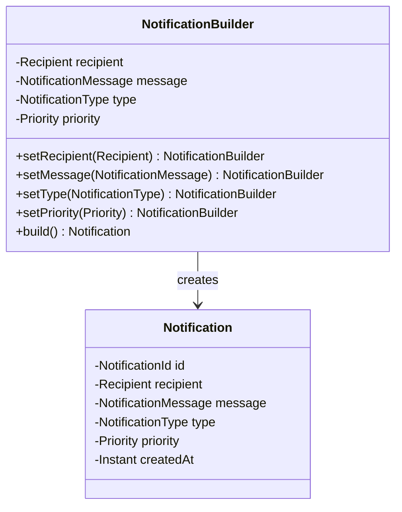
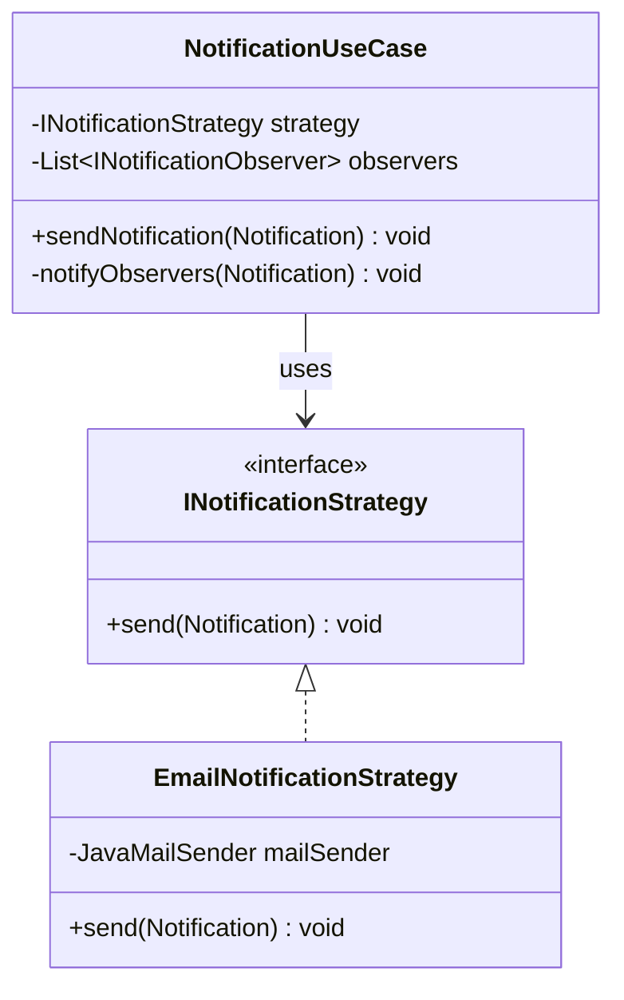
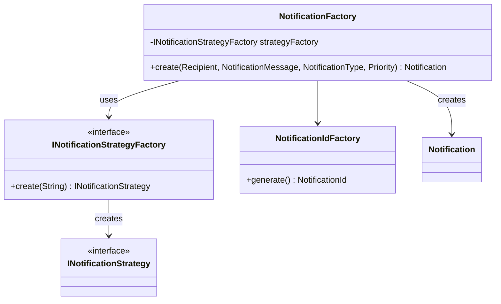
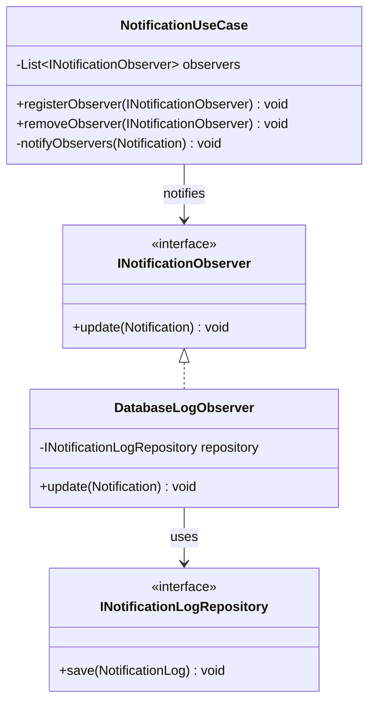
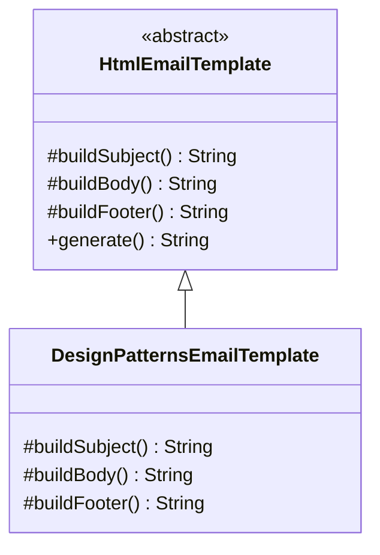
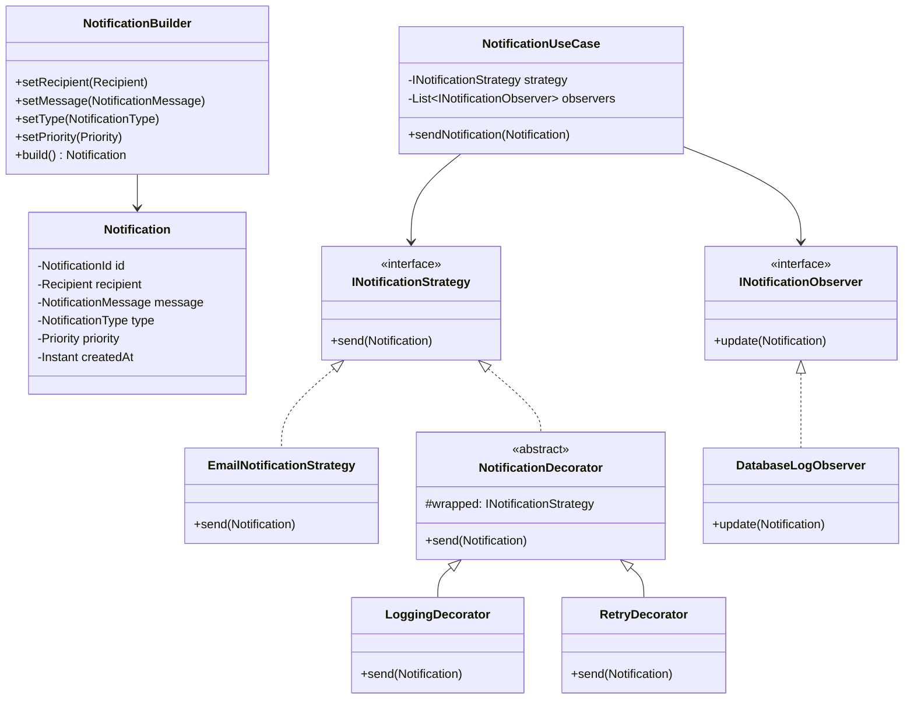

# Notification Hub - Design Patterns Documentation

## 📋 Project Description

**Notification Hub** is a Java application that demonstrates the implementation of various design patterns in a notification management and sending system. The project uses **Java 21 LTS** and **Maven** as the build tool.

## 📧 Configuração de E-mail (Gmail)

Para que a aplicação consiga enviar e-mails automaticamente, você precisa gerar uma **Senha de App**. Isso permite que o sistema se autentique no servidor SMTP do Google sem precisar da sua senha principal.

### Passo a Passo para Gerar a Senha de App

1. **Acesse sua Conta Google:**
   Vá para [myaccount.google.com](https://myaccount.google.com/).

2. **Ative a Verificação em Duas Etapas:**
   * No menu lateral, clique em **Segurança**.
   * Procure a seção "Como você faz login no Google".
   * Certifique-se de que a **Verificação em duas etapas** esteja **Ativada**. (Este recurso é obrigatório para gerar senhas de app).

3. **Gere a Senha de App:**
   * Na barra de pesquisa no topo da página de conta, digite **"Senhas de app"** e clique no resultado correspondente.
   * No campo "Nome do app", dê um nome para identificar onde você usará essa senha (ex: `Meu App de Vendas` ou `NodeJS Mailer`).
   * Clique em **Criar**.

4. **Copie o Código:**
   * Uma janela aparecerá com um código de **16 caracteres** em um fundo amarelo.
   * **Copie esse código imediatamente.** Você não conseguirá visualizá-lo novamente depois de fechar a janela.

---

### 🛠️ Configuração no Projeto

No seu arquivo de configuração (geralmente o `.env`), utilize as seguintes credenciais:

```env
EMAIL_USER=seu-email@gmail.com
EMAIL_PASS=o-codigo-de-16-digitos-que-voce-copiou
```

## 🏗️ Architecture

The project architecture is divided into three main layers:

### 1. **Domain Layer**
Contains business entities and domain rules:
- `Notification` - Main notification entity
- `Recipient` - Notification recipient
- `NotificationMessage` - Message content
- `NotificationType` - Type of notification
- `Priority` - Notification priority

### 2. **Application Layer**
Implements design patterns and use cases:
- Builder, Decorator, Factory, Strategy, Template Method, Observer

### 3. **Infrastructure Layer**
Concrete implementations of persistence and sending:
- H2 Database
- Email sending strategy
- Log repository

---

## 🧭 Architectural Style (Clean Architecture)

This project follows principles inspired by **Clean Architecture**, ensuring a clear separation of concerns and high maintainability.

Key principles applied:

- **Domain layer is framework-agnostic**
- **Application layer orchestrates use cases and business flows**
- **Infrastructure layer depends on abstractions (ports)**
- **Dependency Inversion Principle (DIP)** is enforced through interfaces

This approach allows the system to evolve with minimal impact when introducing new notification channels or infrastructure changes.


## 🎯 Design Patterns Implemented

### 1️⃣ **Builder Pattern**

Used to construct complex `Notification` objects in a fluent and safe manner.



---

### 2️⃣ **Strategy Pattern**

Defines different notification sending strategies that can be used interchangeably.



---

### 3️⃣ **Decorator Pattern**

Adds extra behaviors to notification strategies without modifying their code.


---

### 4️⃣ **Factory Pattern**

Creates instances of notifications and strategies in a centralized way.



---

### 5️⃣ **Observer Pattern**

Notifies multiple observers when a notification is sent.



---

### 6️⃣ **Template Method Pattern**

Defines the structure of an algorithm in a base class and allows subclasses to implement specific parts.



---

## 📦 Main Dependencies

```xml
<!-- Database -->
<dependency>
    <groupId>com.h2database</groupId>
    <artifactId>h2</artifactId>
    <version>2.2.224</version>
</dependency>

<!-- Email Support -->
<dependency>
    <groupId>com.sun.mail</groupId>
    <artifactId>jakarta.mail</artifactId>
    <version>2.0.1</version>
</dependency>

<!-- Environment Variables -->
<dependency>
    <groupId>io.github.cdimascio</groupId>
    <artifactId>dotenv-java</artifactId>
    <version>3.0.0</version>
</dependency>

<!-- Logging -->
<dependency>
    <groupId>ch.qos.logback</groupId>
    <artifactId>logback-classic</artifactId>
    <version>1.4.12</version>
</dependency>

<!-- SMS Support -->
<dependency>
    <groupId>com.twilio.sdk</groupId>
    <artifactId>twilio</artifactId>
    <version>9.0.0</version>
</dependency>
```

---

## 🗂️ Directory Structure

```
notifications/hub/
├── src/main/java/com/notifyhub/
│   ├── application/          # Application Layer
│   │   ├── builder/          # Builder Pattern
│   │   ├── config/           # Configuration
│   │   ├── decorator/        # Decorator Pattern
│   │   ├── exception/        # Custom Exceptions
│   │   ├── factory/          # Factory Pattern
|   |   ├── observer/         # Observer Pattern
│   │   ├── port/             # Interfaces (Strategy, Observer, Repository)
│   │   ├── templates/        # Template Method Pattern
│   │   └── usecase/          # Use Cases
│   ├── domain/               # Domain Layer
│   │   ├── Notification.java
│   │   ├── NotificationId.java
│   │   ├── NotificationMessage.java
│   │   ├── NotificationType.java
│   │   ├── Priority.java
│   │   └── Recipient.java
│   ├── infra/                # Infrastructure Layer
│   │   ├── db/               # Database Connection
│   │   ├── persistence/      # Persistence Models
│   │   ├── repository/       # Repository Implementations
│   │   └── EmailNotificationStrategy.java
│   └── Main.java             # Entry Point
└── pom.xml                   # Maven Configuration
```

---

## 🔧 Use Cases

### Send Notification with Logging and Retry

```java
NotificationUseCase service = NotificationAplication.start();
        String emailSender = "email@hotmail.com";
        String recipientName = "name";
        Recipient recipient = new Recipient(emailSender,recipientName);
        String title = "Notification with strategy E-mail";
// Create notification
NotificationMessage message = new NotificationMessageBuilder()
                .setTitle(title)
                .setContent(html)
                .build();

// Apply decorators (Logging + Retry)
Notification notification = new NotificationBuilder()
                .setRecipient(recipient)
                .setMessage(message)
                .setType(NotificationType.EMAIL)
                .setPriority(Priority.LOW)
                .build();

// Execute use case
service.sendNotification(notification);
```

---

## 🚀 How to Compile and Run

### Prerequisites
- Java 21 LTS
- Maven 3.9.12+

### Compile
```bash
cd notifications/hub
mvn clean compile
```

### Run Tests
```bash
mvn test
```

### Full Build
```bash
mvn clean package
```

### Run Application
```bash
mvn exec:java -Dexec.mainClass="com.notifyhub.Main"
```

---

## 📊 General Class Diagram



---

## 📝 Educational Resources

This project is an excellent example of the implementation of the following GOF (Gang of Four) patterns:

- ✅ **Creational**: Builder, Factory
- ✅ **Structural**: Decorator
- ✅ **Behavioral**: Strategy, Observer, Template Method

---

## 👨‍💻 Java Version

**Java 21 LTS** - Long Term Support

Benefits of upgrading to Java 21:
- ✨ Record classes (enhanced)
- 🔒 Sealed classes improved
- ⚡ Advanced pattern matching
- 🧵 Virtual Threads (Project Loom)
- 🎯 Better performance and security

---

## 📄 License

This project is provided as educational material.

---

**Last updated**: January 2026
**Java Version**: 21 LTS
**Maven Version**: 3.9.12+
